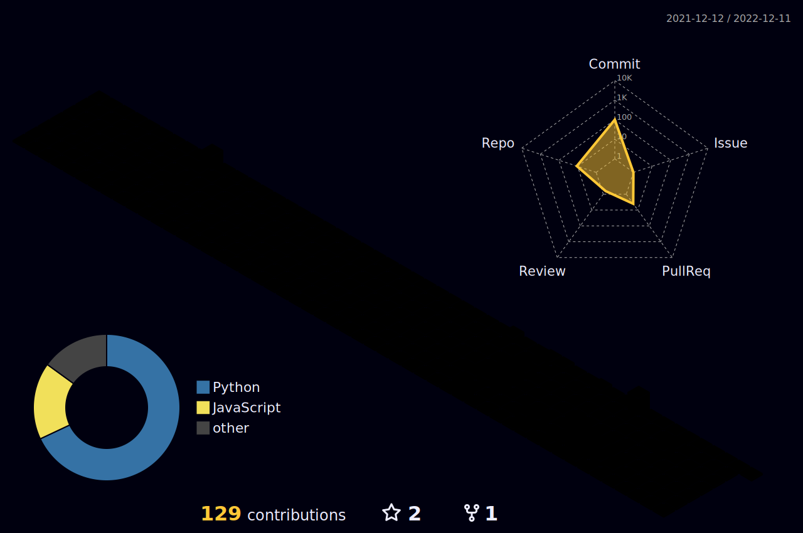

  
  

    
    
    
  

  

  <a href="https://www.meyta.pp.ua">
     
  

    
  <h1>
    Oh hey — I'm Meyta Dmitry
    
  </h1>

  

---

### :woman_technologist: About Me :
I am a Full Stack Developer  from Ukraine.
- :telescope: Now I'm just gaining practical experience, writing my phone book, making small console games. But right now my main project is a portfolio site, it will be very cool!)

- :seedling: Learning how to write optimized, concise, concise, readable code.

- :zap: In my free time I take tests in telegram groups, read articles, solve various problems.

- :mailbox:How to reach me: 

---

### :hammer_and_wrench: Languages and Tools :

  &nbsp;
  &nbsp;
  &nbsp;
  &nbsp;
  &nbsp;
  &nbsp;
  &nbsp;
  &nbsp;
  &nbsp;
  

---

### :fire: My Stats :
  

 
GitHub Stats 📈 

 

|  | 
&nbsp;
 |
| ------------- | ------------- |

<!-- svg source =  https://worldvectorlogo.com -->

  
  
---
