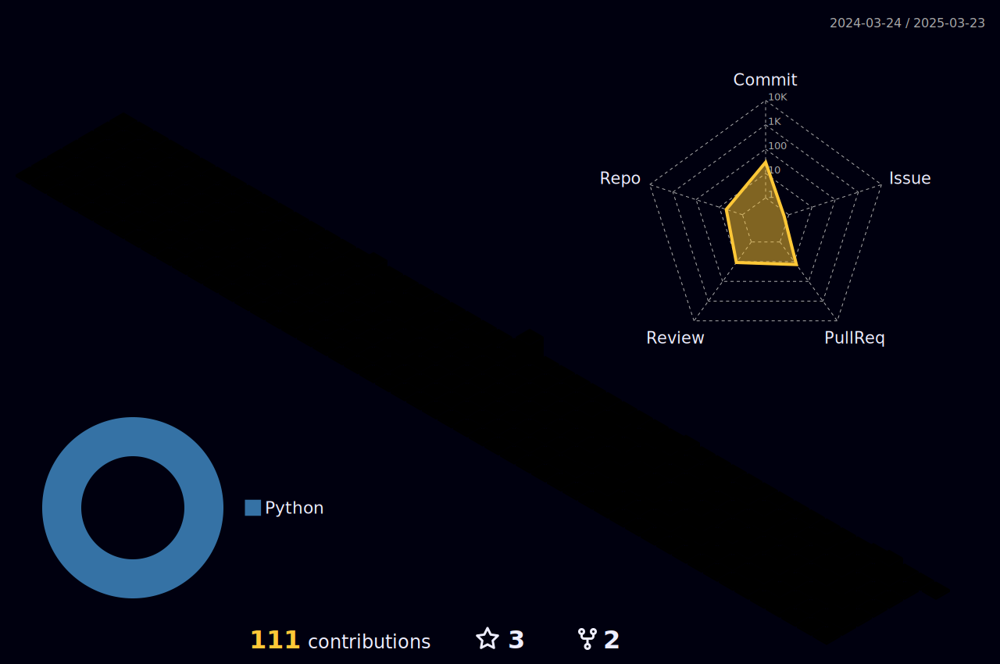

  
  

    
    
    
  

  

  <a href="https://www.meyta.pp.ua">
     
  

    
  <h1>
    
    
  </h1>

  

---

### :woman_technologist: About Me :
I am a Full Stack Developer  from Ukraine.
- :telescope: I possess over 4 years of professional experience as a AQA Engineer, specializing in the establishment of QA processes, team leadership, test documentation creation, and testing of mobile and web applications. My expertise extends to back-end and API testing, and I am proficient in developing testing frameworks using Selenium (Java) and Playwright (JS).

- :seedling: Beyond my professional endeavors, I bring a robust sports background that emphasizes goal-setting and teamwork, contributing to the development of my analytical and problem-solving skills as well as a strong sense of responsibility.

- :zap: This experience, coupled with my passion for sports, has nurtured my ability to think creatively and propose innovative ideas.

- :mailbox:How to reach me: 

---

### :hammer_and_wrench: Languages and Tools :

  &nbsp;
  &nbsp;
  &nbsp;
  &nbsp;
  &nbsp;
  &nbsp;
  &nbsp;
  &nbsp;
  &nbsp;
  
  &nbsp;
  &nbsp;
  &nbsp;
  &nbsp;
  &nbsp;
  &nbsp;
  &nbsp;
  
  &nbsp;
  &nbsp;
  &nbsp;
  &nbsp;
  &nbsp;
  &nbsp;
  &nbsp;

---

### :fire: My Stats :
  
GitHub Stats 📈 
 

|  | 
&nbsp;
 |
| ------------- | ------------- |

<!-- svg source =  https://worldvectorlogo.com -->

  
  
---
